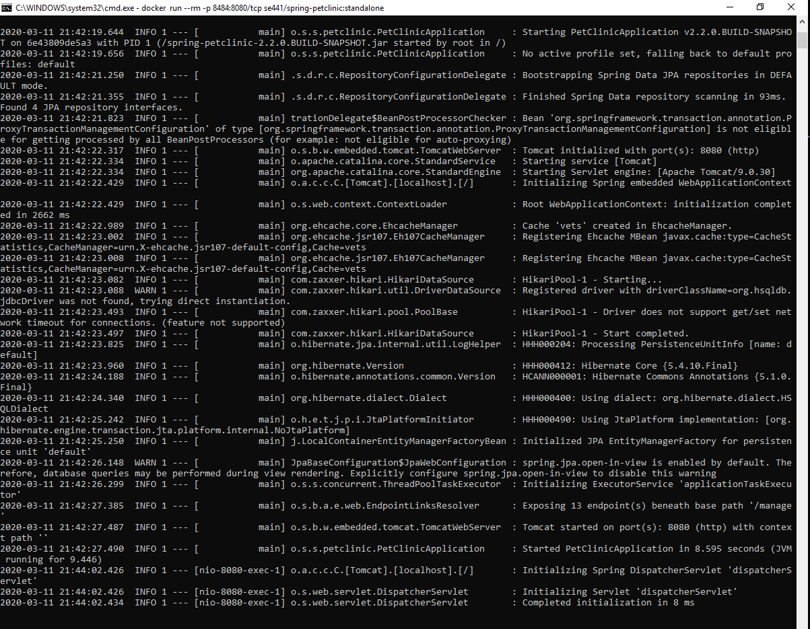
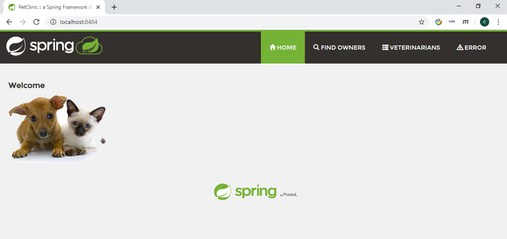

# Instructions
Dongdong Li (ID: 1924542)

Add your screen captures to a new directory called [images](images).

# Deliverables [50 pts]

# DOCKER        
- [5 pts] Your dockerfile. Please provide a link to this file rather than a screen capture.
[Link] (https://github.com/Tylon-ldd/spring-petclinic-hw08/blob/master/Dockerfile)
- [5 pts] Your running docker instance as shown by a ps command.

- [5 pts] Your browser accessing the main page of the website from your local container.

# DOCKER COMPOSE - MYSQL ONLY
- [5 pts] The output from the docker-compose up command.

- [5 pts] Your browser accessing the “Veterinarians” page of the website from your local container
when you run the application from the host system.

- [5 pts] A section of the stack trace generated when you attempt to run the application
container that has been updated to use MySQL.

# DOCKER COMPOSE - APP SERVER AND MYSQL
- [5 pts] Your updated docker-compose.yml file containing the application server, built from
your local Dockerfile, and the existing MySQL configuration. Please provide a link
to this file rather than a screen capture.

- [5 pts] Your updated application-mysql.properties file containing the URL change for
the database server. Please provide a link to this file rather than a screen capture.

- [5 pts] The output from the docker-compose up command.

- [5 pts] Your browser accessing the “Veterinarians” page of the website from your local container.

